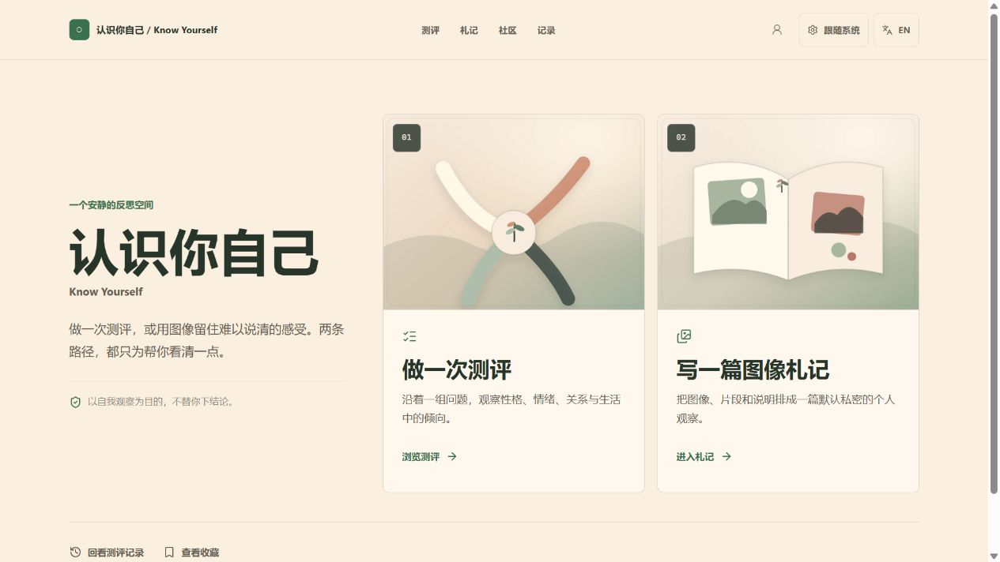

# 认识你自己 · Know Yourself

> **一个安静的中英双语自我反思空间。** 做一次测评，或在社区分享文字与图像，把此刻的观察留给可能懂你的人。
>
> **A calm, bilingual space for self-reflection. See patterns, not labels.** Take an assessment, or share words and images with the community when you choose.

[在线体验 / Live demo](https://knowyourself.cc.cd/) · [浏览测评](https://knowyourself.cc.cd/assessments/) · [了解隐私边界](https://knowyourself.cc.cd/privacy/)

[](https://knowyourself.cc.cd/)

它不是一个尽量塞满测试的目录，也不会用结果替用户下结论。测评帮助你沿着问题看见倾向；社区允许你用文字、图像或测评结果留下观察。每种表达都只是反思的起点，而不是诊断、治疗建议或固定身份。

## 为什么值得关注

- **一种社区，多种表达方式**：可以分别发布文字、测评结果或图像帖；图像帖本身支持图片、说明文字和图片说明。
- **精选而不是堆量**：只公开 16 条经过审阅的中英双语路线，覆盖人格、情绪、关系、工作与日常生活。
- **隐私落实到产品状态**：游客测评数据默认留在浏览器；札记默认私密；图片处理会清除 EXIF、GPS、设备信息和原文件名，并丢弃原始上传。
- **完整的生产级开源参考**：Next.js 16、React 19、Better Auth、SQLite、Sharp、持久任务队列、内容治理、自托管发布和自动化 smoke test 共同组成可运行的真实系统。

## 当前版本

- **双入口首页**：从“做一次测评”或“在社区发一篇图文”开始，完整测评目录位于 `/assessments/`
- **16 条公开测评路线**：覆盖 type、dimensions、score 三类评分；193 个内部模块继续按质量逐批审阅
- **四条结果图像试点**：动物人格、情绪调节、依恋风格和生活满意度使用无内嵌文字的隐喻场景；类型、主导维度或稳定 score-band 决定结果图，缺失或并列结果回退到封面
- **图像札记**：邮箱已验证的登录用户可以创作包含 1 至 6 张有序图片的私密草稿，设置每图说明、替代文字或装饰标记，并使用自动保存、中断恢复、上传进度、网络中断重传、处理失败替换和键盘排序
- **不可变公开修订**：发布会创建独立公开快照；后续编辑先留在私密草稿，只有显式“更新公开版”才替换公开修订；取消公开与永久删除是不同操作
- **统一社区 Feed**：`/community/` 混合展示测评、文字和图像帖子，并提供类型筛选；旧图像札记通过兼容适配进入图像流，文字帖默认不公开头像
- **互动与治理**：公开内容支持共鸣、留言和举报；高危举报首次即自动隐藏，普通举报由 3 名独立举报者触发临时隐藏，管理员可恢复或永久下架
- **账号与验证**：支持邮箱密码账号、验证邮件、忘记密码邮件找回、注册及上传 Turnstile、个人资料、改密、自动同步和账号删除
- **本地优先**：游客测评结果默认留在当前浏览器；登录后自动与账号云端数据合并，Storage v3 和既有测评历史协议保持不变
- **媒体最小化**：只接受静态 JPEG、PNG、WebP；处理后生成 320、960、1600 像素 WebP 变体，清除 EXIF/GPS/设备信息和原文件名，不保留原始上传
- **自托管发布架构**：standalone 产物包含 Node 应用和媒体 worker；生产需要在自有 VPS 配置 SQLite、持久媒体目录、Caddy 与外部验证/邮件服务

## 体验路线

| 页面 | 作用 |
| --- | --- |
| `/` | 在结构化测评与社区图文分享之间选择 |
| `/assessments/` | 浏览、搜索和筛选 16 条公开测评路线 |
| `/test/[id]/` | 测评详情、题量、时长、示例问题、收藏和试点视觉 |
| `/quiz/[type]/` | 答题、进度、键盘操作、未完成会话恢复 |
| `/result/[type]/` | 结果解读、结果视觉、匿名图像帮助度反馈、分享和重新测评 |
| `/journal/` | 私密札记库、草稿与已发布状态、账号配额 |
| `/journal/new/` | 创建图像札记 |
| `/journal/[id]/edit/` | 编辑、私密预览、公开预览和公开修订管理 |
| `/journal/[id]/` | 已发布札记详情；隐藏、取消公开或删除后不可公开访问 |
| `/community/` | 统一浏览和发布测评、文字与图像分享 |
| `/history/` | 完成记录；游客保存在本机，登录后自动同步 |
| `/bookmarks/` | 收藏的测评 |
| `/settings/` | 语言、主题、本地数据导入导出与清理 |
| `/account/` | 注册、邮箱验证、登录、忘记密码找回、自动同步、个人资料与账号管理 |
| `/privacy/` | 数据、媒体、公开索引和备份说明 |
| `/complaints/` | 无需登录的隐私与版权投诉 |
| `/admin/moderation/` | 环境配置指定管理员使用的治理后台 |

已移除的 secondary routes 不再生成：analytics、dashboard、stats、trends、compare、compat 及其他旧内容型页面。旧 URL 不做兼容跳转。

## 技术栈

- Next.js 16 App Router + React 19 + TypeScript
- Tailwind CSS v4 + 原生 CSS tokens
- Better Auth + better-sqlite3
- Sharp 媒体处理 + 持久 SQLite 任务队列
- Nodemailer SMTP 验证与重置邮件 + Cloudflare Turnstile
- 自有 VPS、Node standalone 服务、媒体 worker 与 Caddy HTTPS

## 目录结构

```text
src/
|- app/
|  |- page.tsx                 # 双入口首页
|  |- assessments/             # 完整测评目录
|  |- test/[id]/               # 测评详情
|  |- quiz/[type]/             # 答题
|  |- result/[type]/           # 结果
|  |- journal/                 # 札记库、编辑器与公开详情
|  |- community/               # 统一社区 Feed、文字/测评/图像发布
|  |- admin/moderation/        # 单一运营管理员后台
|  |- complaints/              # 无登录投诉
|  |- account/                 # 注册、验证、登录、找回密码与账号管理
|  `- api/                     # 认证、同步、札记、治理和指标接口
|- components/
|  |- journal/                 # 札记编辑、预览、详情与互动
|  |- community/               # 统一社区 Feed 与发布器
|  |- quiz/                    # 答题引擎与测评视觉
|  `- result/                  # 结果叙事、视觉和反馈
|- core/quiz/                  # QuizDefinition、媒体契约与评分
`- lib/
   |- quiz-definitions/        # 16 个公开测评定义
   |- tests/                   # 193 个内部测评模块
   |- server/                  # SQLite、鉴权、札记、治理与邮件
   `- storage.ts               # know-yourself:v3 snapshot
```

## 本地开发

```bash
npm install
npm run dev
```

另开一个终端启动持久媒体任务：

```bash
npm run media:worker
```

打开 `http://localhost:3333/`。默认开发数据库、媒体和备份位于 `.data/`；可通过 `DATABASE_PATH`、`MEDIA_ROOT` 和 `BACKUP_ROOT` 覆盖。媒体 worker 每小时检查一次备份状态，每个 UTC 日期最多创建一个自动快照；`npm run media:backup -- --force` 可用于显式快照测试。

要完整测试注册、验证和上传，还需配置：

```dotenv
BETTER_AUTH_SECRET=replace-with-a-long-random-secret
BETTER_AUTH_URL=http://localhost:3333
TURNSTILE_SITE_KEY=...
TURNSTILE_SECRET_KEY=...
TURNSTILE_ALLOWED_HOSTNAMES=localhost,127.0.0.1
SMTP_HOST=...
SMTP_PORT=587
SMTP_FROM=...
SMTP_USER=...
SMTP_PASSWORD=...
SMTP_SECURE=false
JOURNAL_ADMIN_USER_ID=...
```

客户端通过运行时 `/api/config/turnstile` 读取 `TURNSTILE_SITE_KEY`；`/api/config/account` 只返回邮箱验证、注册与找回密码是否可用的布尔值，不返回 SMTP 主机、账号或密钥。注册、重发与找回密码接口在运行配置缺失时直接返回 `503`，注册成功后再显式发送验证邮件，因此界面不会把失败投递显示为成功。忘记密码请求由 Turnstile 保护并返回统一响应（不区分邮箱是否已注册），重置邮件链接 30 分钟内一次性有效，重置成功后其他设备的登录状态会被吊销。`NEXT_PUBLIC_TURNSTILE_SITE_KEY` 仅作为本地或旧部署兼容项。`SMTP_USER` 和 `SMTP_PASSWORD` 必须同时提供或同时省略；`JOURNAL_ADMIN_USER_ID` 也可使用兼容变量 `ADMIN_USER_ID`，当前生产设计只配置一个管理员用户 ID。生产密钥只放在服务器环境文件中，不提交到仓库。

Turnstile、SMTP、管理员 ID、媒体目录和备份目录都是生产发布的必需运行时配置或验收项。仓库提供相应代码路径，但不能据此推断生产服务器已经填入有效密钥或完成外部服务验证。

## 媒体边界

- 每篇札记必须有 1 至 6 张图片；标题、正文和图片说明可选，非装饰图片必须提供 alt
- 单图最多 8 MiB、25 MP；拒绝 SVG、GIF、动画 WebP、HEIC、远程 URL、损坏文件和 MIME 伪造
- 每个账号每日最多上传 20 张、公开发布 3 次，总媒体配额 250 MiB；配额与一分钟 API 限流持久化到 SQLite，限流键只保存 SHA-256 摘要
- 私密变体通过 owner 鉴权 API 读取；公开修订只引用处理后的公开变体
- 结构化记录存入 SQLite，图片文件不以 BLOB 或 base64 写入数据库

## 验证命令

```bash
npm run lint
npm run typecheck
npm test
npm run audit:flagship
npm run audit:a11y
npm audit --audit-level=high
npm run build
npm run package:standalone
```

`npm test` 串行覆盖 registry、三类评分、测评视觉选择、Storage v3、云端 revision、社区、札记媒体与治理、Turnstile 运行时配置契约、忘记密码找回链路，以及分享输出。`audit:flagship` 只审阅 16 条公开测评路线；`audit:a11y` 检查静态无障碍约束。发布前仍需按 [QA_CHECKLIST.md](./QA_CHECKLIST.md) 完成浏览器、窄屏、媒体、权限、治理和生产 smoke test。

生产构建产物位于 `.next/standalone/`。部署时由 Node 服务和媒体 worker 处理应用请求及持久任务，Caddy 负责 HTTPS、公开媒体和反向代理；这些生产条件必须按 [deploy/README.md](./deploy/README.md) 配置并验收。`scripts/serve-static.mjs` 仅用于本地静态预览，不是生产入口。

## 添加测评与视觉

1. 在 `src/lib/tests/<id>.ts` 创建双语测评模块；标准定义放在 `src/lib/quiz-definitions/<id>.ts`。
2. 在 `src/lib/test-registry.ts` 添加带 `loader` 的注册项。
3. 如需公开入口，在 `src/lib/core-tests.ts` 明确加入。
4. 可选 `QuizDefinition.media` 只保存封面、result key 和稳定 score-band ID 到 `QuizVisual` 的映射；不要把图片 URL 写入 `QuizResult` 或历史记录。
5. 为每张视觉提供固有宽高、双语 alt 和可选焦点，并运行 `npm run test:quiz-media`。

不要另建第二份测试 ID 数组、动态 import map 或页面专用评分逻辑。

## 产品边界

- 游客仍可完成测评；图像札记要求登录且邮箱已验证
- SMTP 仅用于邮箱验证与忘记密码重置邮件；重置令牌 30 分钟内一次性有效，找回请求响应不区分邮箱是否已注册
- 首版札记不支持 Markdown、HTML、视频、滤镜、贴纸、自由画布、远程图片或运行时 AI 生图
- 用户内容只记录所选内容语言，不要求中英双份，也不自动翻译
- 首版不做发布前内容审核或合法敏感内容遮罩；违法内容、未成年人性内容、非自愿私密影像、隐私泄露和明确伤害内容仍可被举报并按治理规则处理
- 发布内容会立即公开并允许搜索引擎索引；站内取消公开或删除不能撤回第三方缓存
- 不做 AI 生成解读，不把结果表述为临床诊断、治疗建议或专业评估
- 不迁移旧 localStorage 数据；继续使用 `know-yourself:v3` 命名空间

## License

MIT
